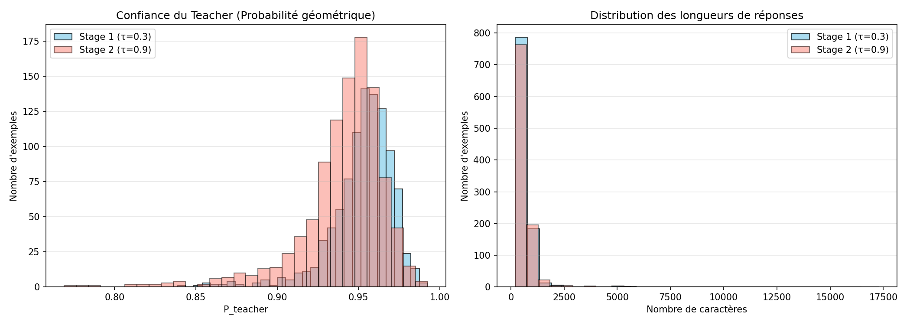
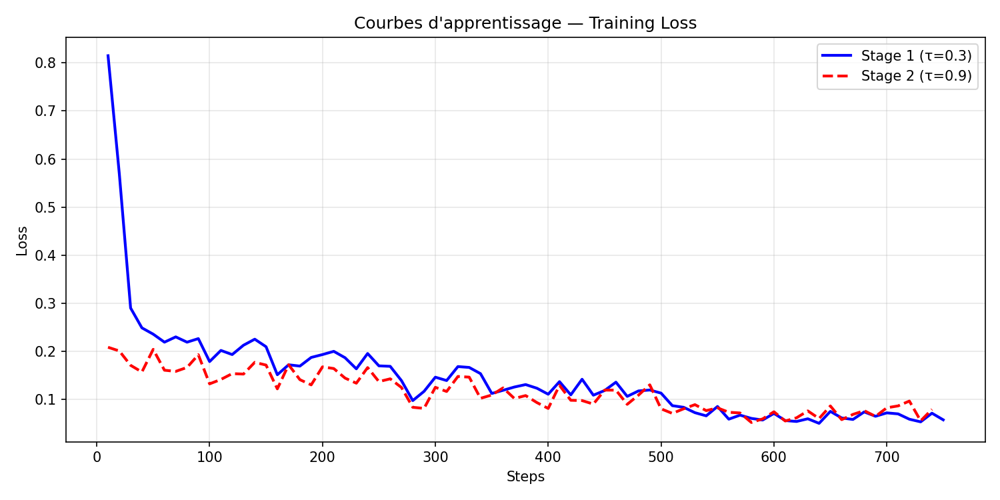

# TP4 — Distillation de Modèles de Raisonnement (DASD)

**Distribution-Aligned Sequence Distillation for Superior Long-CoT Reasoning**

---

## 1. Introduction

L'objectif de ce TP est d'implémenter la méthode DASD (Distribution-Aligned Sequence Distillation) présentée par Alibaba en 2026. Le problème de départ est simple : les grands modèles de langage comme GPT-4 ou Qwen-235B ont des capacités de raisonnement excellentes, mais ils sont impossibles à déployer localement. L'idée est donc de transférer ces capacités vers un modèle compact.

La distillation classique consiste à utiliser les réponses d'un grand modèle "enseignant" pour fine-tuner un petit modèle "étudiant". Le problème c'est que toutes les réponses du teacher ne sont pas forcément utiles pour l'étudiant — certaines correspondent à des connaissances qu'il maîtrise déjà, d'autres à des hallucinations. DASD propose deux mécanismes pour adresser ça :

- **Temperature-Scheduled Learning** : générer des données à basse température (τ=0.3, données stables) pour un premier entraînement, puis à haute température (τ=0.9, données plus diverses) pour affiner.
- **Divergence-Aware Sampling (DAS)** : filtrer les données en ne gardant que les exemples où le teacher est confiant mais l'étudiant ne l'est pas, c'est-à-dire là où l'apprentissage apportera le plus de valeur.

Dans ce TP, on utilise GPT-oss-120B (via l'API Infomaniak) comme teacher et Qwen3-4B comme étudiant.

---

## 2. Méthodologie

### 2.1 Génération du dataset

On part du dataset GSM8K (problèmes de mathématiques), qui est bien adapté pour évaluer les capacités de raisonnement. On utilise 1000 questions pour le Stage 1 et 1000 pour le Stage 2.

Pour chaque question, on appelle le teacher via l'API avec un prompt système qui l'encourage à structurer son raisonnement dans des balises `<reasoning>` :

```
You are a math expert. Solve the problem step by step.
Structure your reasoning inside <reasoning> tags.
```

L'API renvoie la réponse et les **logprobs** (log-probabilités de chaque token), ce qui est essentiel pour le DAS. On génère 8 requêtes en parallèle pour limiter le temps de génération.

### 2.2 Implémentation du DAS

L'algorithme DAS analyse la divergence entre la confiance du teacher et celle de l'étudiant. Pour chaque réponse, on découpe le texte phrase par phrase avec NLTK, et on calcule :

- **P_teacher** : probabilité géométrique moyenne du teacher sur l'ensemble de la réponse
  `P_teacher = exp(mean(logprobs_teacher))`

- **P_student** : probabilité que l'étudiant génère cette phrase étant donné le contexte précédent
  `P_student = exp(-CrossEntropyLoss)`

On classe ensuite chaque phrase selon la matrice de décision du papier :

| Type | Condition | Action |
|---|---|---|
| **Teacher Sentence** | P_teacher > 0.6 et divergence > 0.15 | Garder (valeur pédagogique forte) |
| **Shared Sentence** | P_teacher > 0.6 et \|divergence\| ≤ 0.15 | Garder (liaison utile) |
| **Student Sentence** | P_student > P_teacher | Rejeter (hallucination probable) |

On ne conserve la réponse finale que si le texte filtré représente au moins 40% de la réponse originale, pour éviter des exemples trop tronqués.

### 2.3 Configuration de l'entraînement

L'entraînement est réalisé avec **Llama-Factory** en deux stages successifs sur Qwen3-4B (quantifié en 4-bit) avec LoRA :

| Paramètre | Stage 1 | Stage 2 |
|---|---|---|
| Données | GSM8K low-temp (τ=0.3) | GSM8K high-temp (τ=0.9) |
| Learning rate | 2e-4 | 1e-4 |
| Epochs | 3 | 3 |
| Batch size | 1 (grad. accum. ×4) | 1 (grad. accum. ×4) |
| LoRA | `lora_target all` | Reprise depuis Stage 1 |

Le Stage 2 repart du checkpoint LoRA du Stage 1 (`--adapter_name_or_path`), ce qui lui permet de raffiner les connaissances acquises en Stage 1.

**Stage 1 :**
```bash
llamafactory-cli train \
    --stage sft \
    --do_train \
    --model_name_or_path unsloth/Qwen3-4B-Instruct-2507-unsloth-bnb-4bit \
    --dataset dasd_stage1 \
    --dataset_dir my_data \
    --template qwen \
    --finetuning_type lora \
    --lora_target all \
    --output_dir saves/qwen_dasd/stage1 \
    --cutoff_len 1024 \
    --per_device_train_batch_size 1 \
    --gradient_accumulation_steps 4 \
    --lr_scheduler_type cosine \
    --logging_steps 10 \
    --warmup_ratio 0.05 \
    --learning_rate 2e-4 \
    --num_train_epochs 3.0 \
    --quantization_bit 4 \
    --fp16
```

**Stage 2 (reprise depuis Stage 1) :**
```bash
llamafactory-cli train \
    --stage sft \
    --do_train \
    --model_name_or_path unsloth/Qwen3-4B-Instruct-2507-unsloth-bnb-4bit \
    --adapter_name_or_path saves/qwen_dasd/stage1 \
    --dataset dasd_stage2 \
    --dataset_dir my_data \
    --template qwen \
    --finetuning_type lora \
    --lora_target all \
    --output_dir saves/qwen_dasd/stage2_final \
    --cutoff_len 1024 \
    --per_device_train_batch_size 1 \
    --gradient_accumulation_steps 4 \
    --lr_scheduler_type cosine \
    --logging_steps 10 \
    --warmup_ratio 0.05 \
    --learning_rate 1e-4 \
    --num_train_epochs 3.0 \
    --quantization_bit 4 \
    --fp16
```

---

## 3. Résultats

### 3.1 Statistiques du dataset



Le dataset généré contient **1000 exemples** pour chaque stage, tous ayant passé le filtre de qualité DAS. Quelques observations :

- La **confiance du teacher** est très élevée et homogène sur les deux stages (Stage 1 : 0.953 en moyenne, Stage 2 : 0.941). Ce résultat était attendu — le modèle GPT-oss-120B est très sûr de lui sur des problèmes mathématiques de niveau GSM8K.
- Les **longueurs des réponses** sont similaires entre les deux stages (Stage 1 : ~697 chars, Stage 2 : ~694 chars). La haute température en Stage 2 ne produit pas des réponses significativement plus longues, mais elles sont plus variées dans leur formulation.

Exemple de réponse Stage 1 (τ=0.3) sur une question GSM8K :
> *"Let's solve this step by step. **Step 1:** Clips sold in April = 48. **Step 2:** Clips sold in May = 48 ÷ 2 = 24. **Total** = 48 + 24 = **72 clips**."*

Exemple de réponse Stage 2 (τ=0.9) sur la même question :
> *"Let's break this down step by step. 1. Clips sold in April: 48. 2. Clips sold in May (half of April): 24. 3. Total = 48 + 24 = **72 clips**."*

On voit que la structure change légèrement entre les deux stages, ce qui introduit de la diversité dans le dataset d'entraînement.

### 3.2 Courbes d'apprentissage



Les courbes montrent plusieurs choses intéressantes :

- **Stage 1** : La loss commence à 0.82 et descend rapidement vers 0.06. La descente est prononcée lors des premiers steps (phase de warmup), ce qui est normal avec un scheduler cosine. Le modèle apprend efficacement la structure du raisonnement pas-à-pas.

- **Stage 2** : La loss démarre directement à 0.21, beaucoup plus basse que le début du Stage 1. C'est le signe que le modèle a bien intégré les connaissances du Stage 1. Elle se stabilise autour de 0.08, légèrement au-dessus de la loss finale du Stage 1, ce qui est cohérent — les données de haute température sont plus difficiles et diverses.

L'architecture en deux stages fonctionne bien : le Stage 1 pose les bases du format de raisonnement, et le Stage 2 apporte de la robustesse face à des formulations variées.

### 3.3 Test du modèle distillé

On charge le modèle final (base + adaptateur LoRA Stage 2) et on lui pose une question du dataset GSM8K :

**Question :**
> Natalia sold clips to 48 of her friends in April, and then she sold half as many clips in May. How many clips did Natalia sell altogether in April and May?

**Réponse du modèle distillé :**
> We are told that Natalia sold clips to **48 friends in April**.
>
> In **May**, she sold **half as many** as in April.
>
> So, clips sold in May = 48 ÷ 2 = **24**
>
> Now, to find the **total** clips sold in April and May, we add:
>
> 48 (April) + 24 (May) = **72**
>
> **#### 72**

La réponse est correcte et le modèle a bien appris la structure pas-à-pas des données d'entraînement. Pour interagir avec le modèle en mode chat :

```bash
llamafactory-cli chat \
    --model_name_or_path unsloth/Qwen3-4B-Instruct-2507-unsloth-bnb-4bit \
    --adapter_name_or_path saves/qwen_dasd/stage2_final/checkpoint-500 \
    --template qwen \
    --quantization_bit 4
```

---

## 4. Discussion

### Ce qui a bien marché

La génération parallèle avec ThreadPoolExecutor a permis de générer 2000 exemples rapidement. Le filtre DAS a fonctionné — sur les problèmes mathématiques de GSM8K, le teacher étant très confiant (P_teacher ~0.95), la plupart des exemples ont passé les critères.

La progression de la loss en deux stages est claire et correspond à ce qu'on attendait. Le fait que le Stage 2 reparte d'une loss basse valide l'approche : il n'a pas eu à repartir de zéro.

### Limites

**Le calcul P_teacher est approximatif.** Le papier DASD original calcule la probabilité du teacher au niveau de la phrase (en accédant directement aux logits du modèle). Ici, on utilise la moyenne globale sur toute la réponse comme proxy, ce qui est moins précis mais c'est la contrainte d'une API : on n'a accès qu'aux logprobs token-par-token, pas aux probabilités conditionnelles par phrase.

**Le dataset GSM8K est peut-être trop simple.** La haute confiance du teacher (>0.95 en moyenne) suggère que ces problèmes ne représentent pas réellement une zone de divergence forte entre le teacher et l'étudiant. Pour un projet plus poussé, il faudrait utiliser des benchmarks de raisonnement plus complexes (MATH, AIME, etc.).

**L'évaluation quantitative manque.** Faute de temps, on n'a pas pu comparer les performances avant/après distillation sur un benchmark standardisé. Idéalement, il faudrait mesurer le taux de réussite sur GSM8K test avant et après fine-tuning pour valider l'apport de la méthode.

### Améliorations possibles

- Implémenter le calcul DAS au niveau phrase réel (en utilisant un modèle student hébergé localement pour évaluer chaque phrase avec son contexte)
- Utiliser un dataset source plus difficile (MATH level 4-5, AMC, etc.)
- Ajouter une évaluation sur le test set GSM8K pour quantifier le gain

---

## Conclusion

On a implémenté la méthode DASD de bout en bout : génération d'un dataset via API avec logprobs, filtrage DAS, et entraînement en deux stages avec Llama-Factory. Les courbes de loss montrent que l'entraînement s'est bien déroulé et que l'approche en deux stages est cohérente avec le papier original. Les limites principales viennent de l'approximation du calcul DAS côté teacher (contraint par l'API) et de l'absence d'évaluation finale faute de temps.

---

*Basé sur le papier "Distribution-Aligned Sequence Distillation for Superior Long-CoT Reasoning" — Alibaba, 2026*
