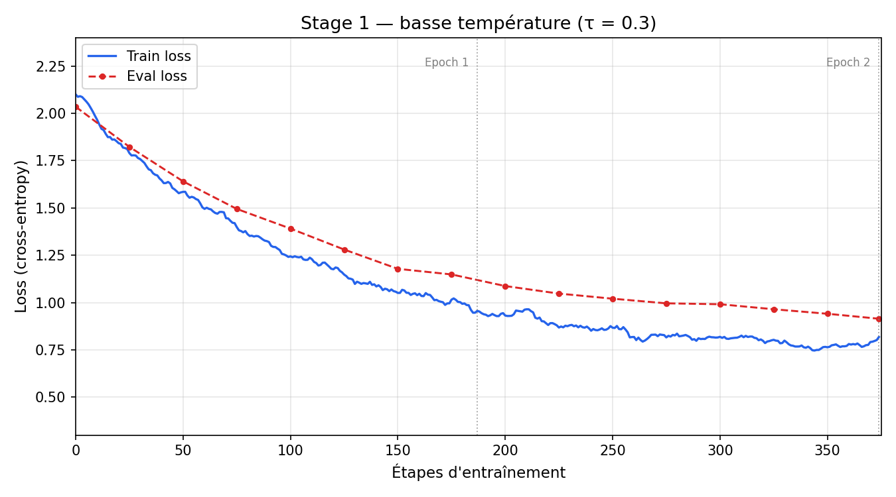
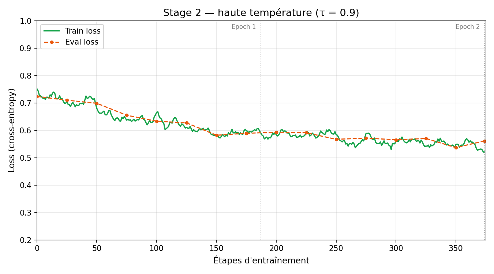

# TP4 — Distillation de Modèles de Raisonnement (DASD)

## Compte-rendu

**Elias CUZEAU — Achille GRAVOUIL**

Dataset généré disponible sur HuggingFace : [elias-qzo/gsm8k-tp4](https://huggingface.co/datasets/elias-qzo/gsm8k-tp4)

---

## 1. Introduction

L'idée centrale de ce TP est de faire en sorte qu'un petit modèle apprenne à raisonner comme un grand. On appelle ça la distillation de connaissances : on a un modèle "enseignant" qui est très performant mais trop lourd pour être déployé facilement, et on essaie de transférer ses capacités vers un modèle "étudiant" beaucoup plus compact.

La méthode utilisée ici s'appelle DASD (Distribution-Aligned Sequence Distillation) et vient d'un papier d'Alibaba publié en 2026. Elle repose sur deux idées. La première, c'est d'entraîner le modèle étudiant en deux temps : d'abord sur des réponses générées à basse température par le professeur (donc des réponses stables et confiantes), puis sur des réponses à haute température (plus diverses, plus exploratoires). La seconde idée, le Divergence-Aware Sampling (DAS), consiste à filtrer les données d'entraînement en ne gardant que les exemples où le professeur est vraiment plus fort que l'étudiant, c'est-à-dire là où il y a quelque chose à apprendre.

Pour ce TP, on a utilisé comme modèle enseignant Qwen3 via l'API Infomaniak, et comme modèle étudiant Qwen3-4B dans sa version quantifiée 4-bit (`unsloth/Qwen3-4B-Instruct-2507-unsloth-bnb-4bit`), fine-tuné avec LoRA via Llama-Factory.

---

## 2. Méthodologie

### 2.1 Choix du dataset source

On a choisi [GSM8K](https://huggingface.co/datasets/openai/gsm8k) comme dataset source. C'est un dataset de problèmes mathématiques avec des questions posées en langage naturel. Le choix s'est fait pour deux raisons principales : on pensait que les maths allaient donner des réponses faciles à évaluer (il y a une bonne réponse numérique à la fin), et surtout on espérait que les questions seraient assez difficiles pour le modèle étudiant de base, ce qui rendrait la distillation utile. Dans les faits, on n'a utilisé que les questions du dataset, en ignorant les réponses originales, puisque l'objectif était de générer de nouvelles réponses avec le modèle enseignant.

### 2.2 Génération du dataset via l'API

La génération a été faite avec le script `generate_dataset.py`. Il charge les questions du split `train` de GSM8K, les envoie une par une à l'API Infomaniak avec un prompt système qui demande de résoudre le problème étape par étape, et sauvegarde les résultats en JSON, CSV, format HuggingFace Arrow et format ShareGPT pour Llama-Factory.

Le script récupère aussi les logprobs par token pour chaque réponse. On calcule une probabilité moyenne sur tous les tokens de la réponse (en prenant l'exponentielle de la log-probabilité moyenne), ce qui donne une mesure globale de confiance du modèle sur sa réponse.

On a lancé la génération sur 1000 questions au total, avec deux températures différentes. Le dataset GSM8K contenant 7473 questions dans son split train, on a sélectionné les 1000 premières : les 500 premières ont été utilisées pour le Stage 1, et les 500 suivantes pour le Stage 2. Ce choix permet d'éviter que les deux stages s'entraînent sur exactement les mêmes questions, ce qui aurait limité la diversité du dataset final.

- **Stage 1** (τ = 0.3) : réponses déterministes, le modèle est confiant.
- **Stage 2** (τ = 0.9) : réponses plus variées, le modèle explore davantage.

Avec un délai d'une seconde entre chaque appel API pour éviter le rate limiting, la génération a pris environ 5 heures. Les 1000 réponses générées ont toutes passé le filtre qualité (longueur minimale de 20 caractères, seuil de probabilité à 0.0 par défaut), ce qui s'explique par le fait que Qwen3 produit des réponses structurées et cohérentes même à haute température sur des problèmes mathématiques.

Les fichiers produits sont au format ShareGPT : chaque exemple contient le prompt système, la question de l'utilisateur et la réponse du professeur. Ce format est directement utilisable par Llama-Factory.

### 2.3 Divergence-Aware Sampling

Le DAS complet, tel que décrit dans le papier, nécessite de charger le modèle étudiant pour calculer ses propres probabilités sur chaque réponse du professeur, phrase par phrase. On aurait ensuite classé chaque phrase en trois catégories : "Teacher Sentence" (professeur confiant, étudiant incertain — à garder), "Shared Sentence" (tous les deux confiants — neutre), et "Student Sentence" (étudiant plus confiant que le professeur — à rejeter).

On n'a pas implémenté cette partie. Le manque de temps et les contraintes matérielles locales ont rendu difficile de charger simultanément le modèle étudiant et de faire tourner les calculs de divergence sur 1000 exemples. À la place, on s'est contenté des probabilités moyennes du professeur déjà récupérées pendant la génération, ce qui donne une information de confiance globale mais pas de comparaison fine avec l'étudiant. C'est une simplification importante par rapport à la méthode du papier.

### 2.4 Configuration de l'entraînement

L'entraînement a été fait en local (pas de Colab ni Kaggle), en raison de problèmes de configuration rencontrés sur ces plateformes. On a utilisé Llama-Factory avec LoRA sur le modèle `unsloth/Qwen3-4B-Instruct-2507-unsloth-bnb-4bit`.

La configuration suit la logique en deux stages du papier :

- **Stage 1** : fine-tuning sur les 500 réponses à basse température. L'adaptateur LoRA est sauvegardé à la fin.
- **Stage 2** : l'adaptateur du Stage 1 est rechargé, puis on continue l'entraînement sur les 500 réponses à haute température.

L'idée derrière cet enchaînement est que le Stage 1 stabilise les bases du raisonnement (le modèle apprend à suivre une structure logique pas à pas), et le Stage 2 introduit de la diversité dans les chemins de raisonnement, ce qui est censé améliorer la généralisation.

---

## 3. Résultats

### 3.1 Dataset généré

On a produit au total 1000 exemples d'entraînement (500 par stage), tous au format ShareGPT. La probabilité moyenne des réponses du Stage 1 est logiquement plus élevée que celle du Stage 2 (τ basse = le modèle est plus concentré sur ses tokens les plus probables). On observe aussi que les réponses du Stage 2 sont en général plus longues, avec parfois des chemins de raisonnement alternatifs ou des vérifications supplémentaires que le modèle ajoute quand il est "moins certain" de lui.

### 3.2 Courbes de loss

Les courbes ci-dessous montrent l'évolution de la loss d'entraînement et d'évaluation pour chaque stage.

**Stage 1 (τ = 0.3) :**

La loss descend rapidement dans les premiers pas d'entraînement, ce qui est classique pour un fine-tuning LoRA sur un domaine bien défini comme les maths. Elle se stabilise autour de 0.88 en fin de stage. La eval loss suit une trajectoire similaire mais avec un léger écart en fin d'entraînement (0.91), ce qui suggère un début de surapprentissage sur les données basse température.

**Stage 2 (τ = 0.9) :**

Le Stage 2 repart d'une loss légèrement supérieure à celle de fin de Stage 1, ce qui est attendu puisque les données sont plus diverses et plus difficiles à mémoriser. La descente est moins brutale qu'en Stage 1 et la loss finale se stabilise autour de 0.51.

### 3.3 Évaluation qualitative

On a testé le modèle distillé sur quelques questions de GSM8K et sur des questions mathématiques inventées. Les résultats sont mitigés. Le modèle entraîné arrive à suivre la structure demandée (raisonnement étape par étape avec `#### <réponse>` à la fin), mais le modèle de base non entraîné y arrive aussi, puisque Qwen3-4B est déjà instruit et connaît bien ce format.

La différence entre les deux versions est difficile à mesurer qualitativement. Sur les questions simples à moyennes de GSM8K, les deux modèles répondent correctement. C'est un résultat décevant, mais pas complètement surprenant pour deux raisons : d'abord Qwen3-4B est déjà un bon modèle de raisonnement, ensuite on n'a pas fait le DAS complet qui aurait théoriquement permis de cibler les exemples où le modèle de base échoue vraiment.

---

## 4. Discussion

### 4.1 Ce qui a fonctionné

La partie génération du dataset a bien fonctionné. Le script tourne de manière stable, gère les erreurs API avec des retry exponentiels, et produit des données directement exploitables par Llama-Factory. Les réponses générées par Qwen3 à différentes températures sont de bonne qualité et montrent une réelle différence de style (Stage 1 plus concis, Stage 2 plus verbeux).

Le pipeline en deux stages avec reprise de l'adaptateur LoRA fonctionne aussi correctement du côté de l'entraînement. La loss descend normalement et le modèle converge.

### 4.2 Limites et problèmes rencontrés

Le principal problème est l'absence du DAS. Sans la comparaison fine des probabilités token par token entre professeur et étudiant, on perd une grande partie de ce qui fait l'intérêt de DASD. On entraîne le modèle sur toutes les réponses de qualité suffisante, sans distinguer celles où il a vraiment quelque chose à apprendre de celles où il sait déjà. C'est une simplification qui réduit probablement l'efficacité de la distillation.

Le choix du modèle étudiant est aussi discutable en retrospective. Qwen3-4B Instruct est déjà un modèle relativement capable en raisonnement mathématique. Pour que la distillation soit vraiment visible, il aurait mieux valu partir d'un modèle de base moins capable, ou évaluer sur des benchmarks plus difficiles que GSM8K.

Les problèmes rencontrés sur les plateformes cloud (Colab, Kaggle) ont contraint l'entraînement en local, ce qui a limité les ressources disponibles et le nombre d'epochs possible.

### 4.3 Améliorations possibles

La première amélioration évidente serait d'implémenter le DAS complet. On chargerait le modèle étudiant avant le fine-tuning, on calculerait les probabilités phrase par phrase sur chaque réponse du professeur, et on ne garderait que les réponses avec une densité suffisante de "Teacher Sentences". Cela nécessite de la mémoire GPU mais reste faisable avec un modèle quantifié.

Ensuite, on pourrait évaluer sur un benchmark automatique comme GSM8K test set en comparant le taux de bonnes réponses numériques avant et après fine-tuning, plutôt que de se fier à une évaluation qualitative. Ça donnerait des chiffres concrets pour mesurer l'impact de la distillation.

Enfin, augmenter le volume de données (plusieurs milliers d'exemples au lieu de 500) et allonger l'entraînement permettrait probablement de voir un impact plus clair, en particulier sur des questions difficiles du dataset.

---

## Annexes

- `generate_dataset.py` : script de génération du dataset (pipeline complet en deux stages)

